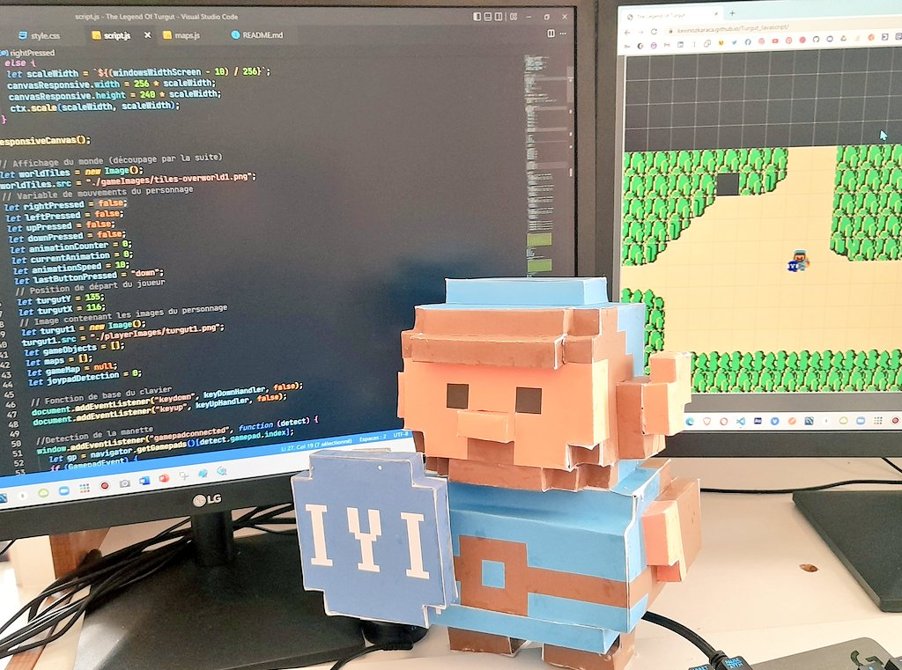
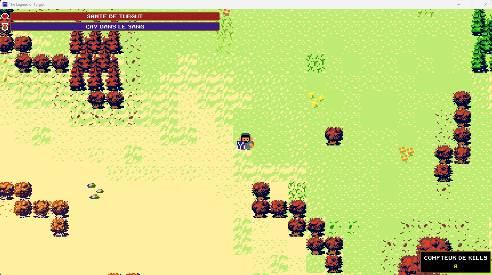

# ⚔️ The Legend Of Turgut ⚔️

## Un jeu d’aventure rétro en pixel-art

### 🎮 Introduction

**Bienvenue dans l’univers de _The Legend of Turgut_**, un jeu d’aventure en pixel-art fait maison !

Passionné par la programmation, j’ai voulu créer un projet ludique qui me pousse à coder régulièrement. Après avoir testé différents moteurs (Phaser.js, Pygame, Unity), j’ai finalement choisi de revenir à une version en **Python**, simple, souple, et idéale pour ce type de jeu.

Mais ce projet n’est pas né tout seul : **mes enfants ont été mes coéquipiers** tout au long du développement. Ils ont dessiné les personnages, imaginé les histoires, et participé à la création des animations. C’est devenu une belle aventure familiale, entre créativité, apprentissage du code et fous rires !

---

#### 🏗️ Architecture du Projet

**Structure modulaire** organisée en classes spécialisées :

```text
001.The Legend Of Turgut [Pygame]/
├── main.py                    # Point d'entrée et boucle principale
├── classes/                   # Architecture orientée objet
│   ├── level.py              # Gestionnaire de niveau et monde
│   ├── player.py             # Héros Turgut (déplacement, combat, animation)
│   ├── entity.py             # Classe mère (déplacement, collisions)
│   ├── enemy.py              # Intelligence artificielle des ennemis
│   ├── camera.py             # Caméra avec zoom x4 et tri Y-sort
│   ├── weapon.py             # Système d'armes (4 types d'attaques)
│   ├── joystick.py           # Gestionnaire de manette de jeu
│   ├── keyboard.py           # Gestionnaire de clavier
│   ├── tile.py               # Tuiles et obstacles de la carte
│   └── ui.py                 # Interface utilisateur (barres de vie/énergie)
├── settings/                  # Configuration centralisée
│   └── settings.py           # Constantes, données armes, positions
├── functions/                 # Utilitaires système
│   ├── get_os_adapted_path.py # Chemins multi-plateforme
│   ├── get_screen_dimensions.py # Adaptation écran automatique
│   ├── debug.py              # Système de débogage visuel
│   └── apply_font.py         # Gestion des polices rétro
├── assets/ imagesOfMaps/     # Ressources graphiques
├── sounds/                   # Effets sonores
└── font/                     # Police pixel-art rétro
```

#### 🎮 Système de Contrôles Hybride (Clavier + Manette)

**Gestion simultanée** clavier et manette Xbox/PlayStation :

- **Détection automatique** : La manette est détectée au démarrage
- **Priorité intelligente** : Le clavier a priorité sur la manette pour éviter les conflits
- **Déplacement anti-diagonal** : Un seul axe à la fois (haut/bas OU gauche/droite)
- **4 armes mappées** : Touches U/I/J/K (clavier) ou boutons 0/1/2/3 (manette)
- **Course** : Touches O/P/L/M (clavier) ou gâchettes L2/R2 (manette)

**Code technique manette** :

```python
# Détection axes analogiques avec zone morte
if joystick and self.direction.length() == 0:
    joystick_x = joystick.get_axis(0)  # Stick gauche X
    joystick_y = joystick.get_axis(1)  # Stick gauche Y

    # Priorité à l'axe dominant (pas de diagonale)
    if abs(joystick_x) > abs(joystick_y):
        if joystick_x < -0.5: self.direction.x = -1  # Gauche
        elif joystick_x > 0.5: self.direction.x = 1  # Droite
```

#### ⚔️ Système de Combat Avancé

**4 types d'attaques** avec animations mathématiques :

- **Hache1** : Attaque circulaire (rotation 360°)
- **Hache2** : Attaque droite (projection linéaire)
- **Hache3** : Attaque en dent de scie (pattern sinusoïdal)
- **Hache4** : Attaque en S (courbe paramétrique complexe)

#### 🎯 Fonctionnalités Techniques

- **Caméra intelligente** : Zoom x4, tri Y-sort pour profondeur
- **Détection de collisions** : Hitbox séparée du sprite pour précision
- **Animation fluide** : 60 FPS avec gestion frame-rate indépendante
- **Chargement de carte** : Analyse pixel par pixel des images PNG
- **Système de debug** : Affichage temps réel des informations
- **Adaptation écran** : Redimensionnement automatique selon résolution

### 🧙‍♂️ Qui est Turgut ?

**Turgut**, c’est notre héros, un jeune nomade venu d’Anatolie, à l’époque des grandes migrations turques. Il explore un monde inspiré de l’histoire et des légendes de Turquie, parfait pour un RPG riche en quêtes et en mystères.

J’ai choisi un style **pixel-art rétro**, à la fois pour le clin d’œil aux jeux de mon enfance (coucou Zelda !) et pour me concentrer sur l’essentiel : le gameplay et la narration.

> 🎨 Le personnage a été imaginé avec **PISKEL**, en hommage à Link, et adapté pour un gameplay moderne, plus interactif.

---

### 👨‍👩‍👧‍👦 Une aventure familiale


Ce jeu, c’est aussi une **histoire de famille**. Entre deux séances de papercraft et de dessins, on a réfléchi ensemble à l’univers, aux personnages, aux dialogues… et même au nom de Turgut !

C’est aussi une super porte d’entrée pour initier les enfants à la **programmation** de manière concrète et amusante.

---

### 🧑‍💻 D'où vient ce projet ?


Chaque mise à jour est l’occasion de peaufiner le code, d’ajouter des mécaniques (gestion de l’inventaire, PNJ, quêtes secondaires…) et de faire tester les nouveautés par mes enfants.

---

### 🧩 Créativité à tous les niveaux



Merci d’avoir pris le temps de découvrir notre projet.  
N’hésitez pas à tester le jeu, à nous faire des retours… ou même à rejoindre l’aventure !

---

### 📜 Images



L'aventure se termine ici pour l'instant...
