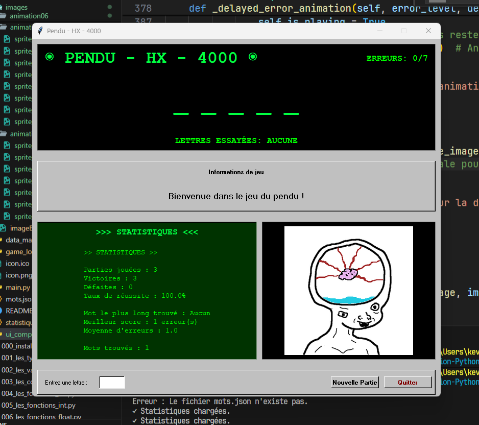

# 🎯 Jeu du Pendu - Version Matrix/Windows 95 avec Animations

## 📋 Description

Ce projet implémente un jeu du pendu complet avec interface graphique hybride Matrix/Windows 95, développé avec tkinter et PIL. Le jeu utilise des animations sprite au lieu de l'art ASCII traditionnel et propose une expérience visuelle unique avec un style rétro-futuriste.

## 📷 Screenshots



## ✨ Fonctionnalités Principales

### 🎮 Gameplay

- **109,282 mots français** chargés depuis `mots.json`
- **6 erreurs maximum** pour une difficulté équilibrée
- **Gestion automatique des accents** : "été" → "ETE", "français" → "FRANCAIS"
- **Conservation des caractères spéciaux** : tirets et apostrophes toujours visibles
- **Saisie immédiate** : pas besoin d'appuyer sur Entrée
- **Animation de victoire** spéciale lors de la réussite

### 🎨 Interface Graphique Hybride

- **Style Matrix** : fond noir, texte vert phosphorescent pour l'affichage du mot
- **Style Windows 95** : boutons et interface classiques rétro
- **Animations sprites 252x252** remplaçant l'art ASCII traditionnel
- **8 niveaux d'animation** : 7 pour les erreurs + 1 animation de victoire
- **Threading pour les animations** fluides et non-bloquantes
- **Feedback visuel immédiat** avec couleurs contextuelles

### 📊 Statistiques Avancées

- **Suivi complet des performances** sauvegardé automatiquement dans `statistiques_pendu.json.json`
- **Pourcentage de réussite** calculé en temps réel
- **Mot le plus long trouvé** et **meilleur score**
- **Historique des mots trouvés** avec persistance
- **Moyenne d'erreurs par partie**

### 🛡️ Robustesse et Architecture

- **Architecture modulaire** avec séparation des responsabilités
- **Gestion complète des erreurs** avec try/catch
- **Validation stricte des saisies** (une lettre uniquement)
- **Gestion des touches spéciales** (Ctrl, Alt, Échap, etc.)
- **Sauvegarde automatique** des statistiques
- **Gestion des ressources** (images, polices)

## 🏗️ Architecture Modulaire

### 📁 Structure des Fichiers

```text
002.Le pendu [Tkinter]/
├── main.py                    # Point d'entrée de l'application
├── game_logic.py             # Logique du jeu et gestionnaire d'animations
├── data_manager.py           # Gestion des données (mots, statistiques)
├── ui_components_matrix.py   # Interface utilisateur hybride Matrix/Win95
├── mots.json                 # Base de données de 109,282 mots français
├── statistiques_pendu.json.json # Fichier de sauvegarde des stats
├── icon.ico / icon.png       # Icônes de l'application
├── images/                   # Dossier des animations
│   ├── animation01/          # Animation 0 erreur (8 sprites)
│   ├── animation02/          # Animation 1 erreur (8 sprites)
│   ├── ...                   # Animations 3-7 erreurs
│   ├── animation07/          # Animation 6 erreurs (8 sprites)
│   ├── animation8/           # Animation de victoire (sprites)
│   └── ScreenApp.png         # Capture d'écran
└── font/                     # Polices Windows 95 (W95FA)
```

### 🧩 Modules Principaux

#### 1. **main.py** - Point d'Entrée

```python
# Responsabilités :
- Vérification des fichiers nécessaires
- Initialisation de l'environnement
- Lancement de l'interface graphique
- Gestion des erreurs de démarrage
```

#### 2. **game_logic.py** - Cœur du Jeu

```python
# Classes principales :
- AnimationManager : Gestion des 8 animations (erreurs + victoire)
- GameManager : Logique du jeu, état, propositions

- Sélection aléatoire des mots
- Gestion des propositions de lettres
- Détection victoire/défaite (6 erreurs max)
- Chargement des animations (animation01-07 + animation8)
- Interface avec DataManager pour les statistiques
```

#### 3. **data_manager.py** - Gestionnaire de Données

```python
# Classes principales :
- DataManager : Gestion mots et statistiques
- normaliser_texte() : Fonction utilitaire de normalisation

# Responsabilités :
- Chargement des 109,282 mots depuis mots.json
- Gestion des statistiques (chargement/sauvegarde)
- Normalisation des textes (suppression accents : été → ETE)
- Conservation des tirets et apostrophes
- Gestion robuste des erreurs de fichiers
```

#### 4. **ui_components_matrix.py** - Interface Hybride

```python
# Classes principales :
- CouleursHybride : Constantes de style Matrix/Windows 95
- PenduUI : Interface graphique complète
- AnimationPlayer : Lecteur d'animations sprites

# Responsabilités :
- Interface graphique tkinter hybride Matrix/Win95
- Gestion des animations 252x252 avec threading
- Couleurs contextuelles (Matrix vert, Win95 gris)
- Gestion événementielle robuste (touches, focus)
- Animation de victoire unique et non-bouclée
```

## 🔧 Fonctionnalités Techniques Avancées

### 🎨 Système d'Animation Sprites

- **8 dossiers d'animations** : animation01 à animation07 (erreurs 0-6) + animation8 (victoire)
- **8 sprites par animation** : sprite_0.png à sprite_7.png dans chaque dossier
- **Taille fixe 252x252** pixels pour toutes les animations
- **Threading non-bloquant** : les animations n'interrompent pas le jeu
- **Animation de victoire unique** : se joue une seule fois, pas en boucle
- **Queue d'animation** : gestion séquentielle des animations

### 🎭 Style Hybride Matrix/Windows 95

- **Couleurs Matrix** : fond noir (#000000), texte vert phosphorescent (#00FF00)
- **Couleurs Windows 95** : boutons gris (#C0C0C0), style rétro authentique
- **Police Windows 95** : W95FA intégrée ou fallback MS Sans Serif
- **Zones d'affichage distinctes** : Matrix pour le jeu, Win95 pour les contrôles

### 🔤 Normalisation Avancée du Texte

- **Suppression des accents** via Unicode NFD : "français" → "FRANCAIS"
- **Conservation des caractères spéciaux** : "saint-pierre" reste "SAINT-PIERRE"
- **Apostrophes préservées** : "aujourd'hui" reste "AUJOURD'HUI"
- **Conversion majuscules automatique** pour l'uniformité

### 📊 Gestion des Statistiques

- **Sauvegarde automatique** dans `statistiques_pendu.json.json`
- **Suivi complet** : parties jouées/gagnées/perdues, pourcentage de victoire
- **Données avancées** : mot le plus long, meilleur score, total erreurs
- **Historique** : liste des mots trouvés avec persistance

### ⚡ Architecture et Performance

- **Architecture modulaire** : séparation claire des responsabilités
- **Gestion d'erreurs robuste** : try/catch à tous les niveaux critiques
- **Validation stricte** : une lettre uniquement, pas de doublons
- **Focus automatique** : expérience utilisateur optimisée
- **Threading intelligent** : animations fluides sans blocage

## 🚀 Comment Lancer le Jeu

### Prérequis

```bash
pip install tkinter pillow
```

### Lancement

```bash
python main.py
```

### Structure des Animations

Chaque dossier d'animation contient 8 sprites nommés `sprite_0.png` à `sprite_7.png` :

- `animation01/` : État initial (0 erreur)
- `animation02/` : 1ère erreur
- `animation03/` : 2ème erreur
- `animation04/` : 3ème erreur
- `animation05/` : 4ème erreur
- `animation06/` : 5ème erreur
- `animation07/` : 6ème erreur (fin de partie)
- `animation8/` : Animation de victoire

## 🎮 Comment Jouer

1. **Démarrage** : Lancez `main.py`, une nouvelle partie commence automatiquement
2. **Saisie** : Tapez directement les lettres (pas besoin d'Entrée)
3. **Feedback** : L'animation et les couleurs évoluent selon vos propositions
4. **Victoire** : Trouvez le mot avant 6 erreurs pour déclencher l'animation de victoire
5. **Nouvelle partie** : Appuyez sur "Nouvelle Partie" ou Échap

## 🔧 Dépendances Techniques

- **Python 3.7+** minimum requis
- **tkinter** : interface graphique (inclus avec Python)
- **PIL/Pillow** : traitement d'images pour les animations
- **json** : gestion des données (inclus avec Python)
- **threading** : animations non-bloquantes (inclus avec Python)
- **unicodedata** : normalisation des accents (inclus avec Python)

## ⚙️ Configuration

Le jeu utilise plusieurs fichiers de configuration :

- `mots.json` : Base de données des mots (109,282 mots français)
- `statistiques_pendu.json.json` : Sauvegarde des performances
- `font/` : Polices Windows 95 pour l'authentique expérience rétro
- `images/` : Toutes les animations sprites organisées par dossier

## 📝 Conseils de Stratégie

- 🔤 **Commencez par les voyelles** : A, E, I, O, U
- 📝 **Puis les consonnes fréquentes** : S, T, R, N, L, M
- 🎯 **Observez la longueur** du mot pour deviner le type
- 📊 **Consultez vos statistiques** pour améliorer votre stratégie
- 🤔 **Attention aux mots avec accents** : ils sont normalisés (été → ETE)
