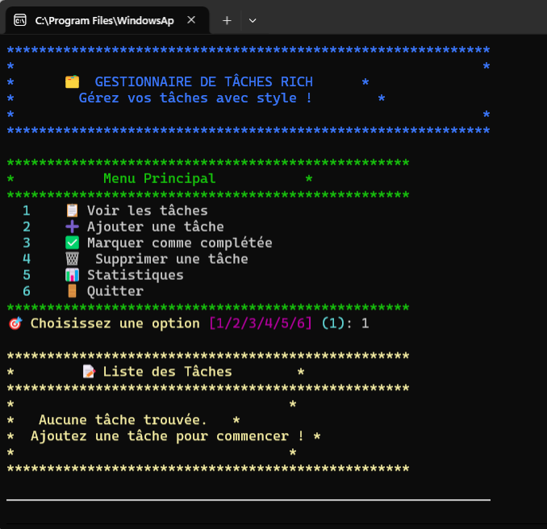

# 🗂️ Task Manager Rich - Gestionnaire de Tâches Coloré

## 🌟 Introduction

**Task Manager Rich** est une version améliorée du gestionnaire de tâches original, utilisant la bibliothèque Python **Rich** pour créer une interface colorée, moderne et interactive dans le terminal.

Cette version transforme l'expérience utilisateur basique en une interface riche avec :

- 🎨 **Interface colorée** avec emojis et styling
- 📊 **Tableaux formatés** pour l'affichage des tâches
- ⏳ **Barres de progression** et animations
- 📦 **Panels informatifs** pour les notifications
- 🎯 **Prompts interactifs** pour la saisie utilisateur

## ✅ Screenshot



---

## 📚 Fichiers du Projet

### 📄 **Fichiers Principaux**

- **`rich_task_manager.py`** - Version améliorée avec Rich
- **`task_manager.py`** - Version originale (basique)
- **`demo_rich.py`** - Démonstration des fonctionnalités Rich
- **`main.py`** - Exemples d'utilisation de Rich
- **`README.md`** - Documentation du projet

### 🗃️ **Fichiers de Données**

- **`tasks.json`** - Stockage des tâches (créé automatiquement)

---

## 🚀 Installation et Configuration

### 📦 **Installation de Rich**

```bash
# Installation via pip
pip install rich

# Vérification de l'installation
python -m rich
```

### ▶️ **Lancement du Programme**

```bash
# Version Rich (recommandée)
python rich_task_manager.py

# Version originale (basique)
python task_manager.py

# Démonstration Rich
python demo_rich.py

# Exemples Rich
python main.py
```

---

## ✨ Fonctionnalités Rich vs Original

### 🎨 **Interface Utilisateur**

| Fonctionnalité    | Original             | Rich                     |
| ----------------- | -------------------- | ------------------------ |
| **Couleurs**      | ❌ Noir et blanc     | ✅ Interface colorée     |
| **Emojis**        | ❌ Caractères ASCII  | ✅ Emojis modernes       |
| **Tableaux**      | ❌ Formatage basique | ✅ Tableaux stylisés     |
| **Notifications** | ❌ Print simple      | ✅ Panels informatifs    |
| **Progression**   | ❌ Aucune            | ✅ Barres de progression |
| **Animation**     | ❌ Statique          | ✅ Animations fluides    |

### 📋 **Fonctionnalités du Programme**

#### **1. 📋 Voir les Tâches**

- **Original** : Liste textuelle basique
- **Rich** : Tableau coloré avec statuts visuels
  - ✅ Tâches complétées (vert, texte barré)
  - ⏳ Tâches en cours (jaune)
  - 📅 Dates de création formatées

#### **2. ➕ Ajouter une Tâche**

- **Original** : Saisie simple + confirmation texte
- **Rich** :
  - Prompt coloré avec validation
  - Animation de création
  - Panel de confirmation stylisé

#### **3. ✅ Marquer comme Complétée**

- **Original** : Sélection par ID + message simple
- **Rich** :
  - Affichage du tableau avant sélection
  - Vérification du statut actuel
  - Animation de félicitations
  - Panel de succès

#### **4. 🗑️ Supprimer une Tâche**

- **Original** : Suppression directe
- **Rich** :
  - Confirmation interactive (Oui/Non)
  - Aperçu de la tâche à supprimer
  - Possibilité d'annulation
  - Panel de confirmation

#### **5. 📊 Statistiques (NOUVEAU)**

- Tableau de statistiques détaillées
- Barre de progression visuelle
- Calcul du pourcentage de completion
- Métriques en temps réel

#### **6. 🚪 Quitter**

- **Original** : Message simple "Au revoir!"
- **Rich** : Panel d'au revoir stylisé

---

## 🎭 Démonstrations Disponibles

### 📄 **demo_rich.py**

Programme interactif montrant toutes les fonctionnalités Rich :

1. **📦 Panels** - Boîtes informatives avec bordures
2. **📊 Tables** - Tableaux formatés et colorés
3. **⏳ Progress** - Barres de progression animées
4. **🎨 Text Styling** - Styles de texte (gras, italique, couleurs)
5. **😀 Emojis** - Utilisation d'emojis dans l'interface
6. **📐 Columns** - Disposition en colonnes
7. **🌳 Tree** - Structure arborescente
8. **💻 Syntax** - Coloration syntaxique de code

### 📄 **main.py**

Exemples de base montrant :

- ASCII Art pour l'en-tête
- Formatage de texte coloré
- Création de tableaux
- Barres de progression simples

---

## 🛠️ Code - Comparaison des Approches

### **Version Originale**

```python
def list_tasks(tasks):
    """Affiche toutes les tâches"""
    if not tasks:
        print("Aucune tâche.")
        return

    print("\n" + "="*50)
    for task in tasks:
        status = "✓" if task["completed"] else "○"
        print(f"[{status}] {task['id']}. {task['title']}")
        print(f"    Créée: {task['created']}")
    print("="*50 + "\n")
```

### **Version Rich**

```python
def list_tasks(self):
    """Affiche toutes les tâches dans un tableau Rich"""
    if not self.tasks:
        panel = Panel(
            "[yellow]Aucune tâche trouvée.[/]\n[dim]Ajoutez une tâche pour commencer !",
            title="[bold yellow]📝 Liste des Tâches",
            border_style="yellow"
        )
        self.console.print(panel)
        return

    # Création du tableau
    table = Table(title="📋 Liste des Tâches", title_style="bold blue")
    table.add_column("ID", justify="center", style="cyan", width=6)
    table.add_column("Statut", justify="center", width=8)
    table.add_column("Tâche", style="white", min_width=30)
    table.add_column("Créée le", style="dim", width=16)

    for task in self.tasks:
        if task["completed"]:
            status = "[green]✅ Fait[/]"
            task_text = f"[dim strikethrough]{task['title']}[/]"
        else:
            status = "[yellow]⏳ En cours[/]"
            task_text = task['title']

        table.add_row(
            str(task["id"]), status, task_text, task["created"]
        )

    self.console.print(table)
```

---

## 🎨 Palette de Couleurs et Emojis

### **Couleurs Utilisées**

- 🔵 **Bleu** (`blue`) : Titres principaux, en-têtes
- 🟢 **Vert** (`green`) : Succès, tâches complétées
- 🟡 **Jaune** (`yellow`) : Avertissements, tâches en cours
- 🔴 **Rouge** (`red`) : Erreurs, suppressions
- 🟣 **Cyan** (`cyan`) : Éléments interactifs, IDs
- 🟠 **Magenta** (`magenta`) : Statistiques, métriques

### **Emojis par Catégorie**

- **Actions** : ✅ ❌ ⏳ 🗑️ 📝 🎯 🚀
- **Interface** : 📋 🗂️ 📦 🎨 📊 🎭 💻
- **États** : 🔥 ⭐ 💡 ⚠️ 🎉 👋 📅

---

## 💡 Apprentissage Rich

Ce projet est parfait pour apprendre Rich car il couvre :

### **Concepts de Base**

- `console.print()` avec styling
- Création de `Table()` avec colonnes
- `Panel()` pour les notifications
- `Prompt.ask()` pour l'interaction utilisateur

### **Concepts Avancés**

- `Progress()` avec animations
- Gestion des couleurs et styles
- Structure de classes avec Rich
- Gestion d'erreurs avec Rich

### **Bonnes Pratiques**

- Organisation du code avec Rich
- Cohérence visuelle de l'interface
- Responsive design dans le terminal
- UX optimisée pour la ligne de commande

---

**Projet développé dans le cadre de la Formation Python**  
_Version Rich - Interface moderne et colorée pour gestionnaire de tâches_

> 🎯 **Objectif** : Transformer une interface basique en expérience utilisateur riche et interactive !
